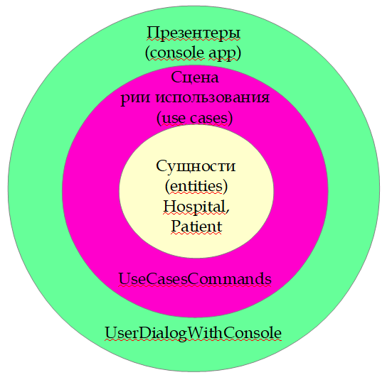

# Консольное приложение: "Автоматизация работы больницы (hospital)"


## Установка и использование
* Установить python3 (например, 3.8) и pip
* Установить виртуальное окружение:
```console
                      python -m venv venv
```
* Активировать виртуальное окружение:
```
                      venv/Scripts/activate.bat
```

* Установить все нужные пакеты, если есть файл requirements.txt:
```console
                      pip install -r requirements.txt
```
* Деактивировать виртуальное окружение, если необходимо:
```
                      venv/Scripts/deactivate.bat
```

### Запуск
* Запустить **main.py**:
```console
                      python main.py
```

* Имеется возможность запуска с помощью start.bat (если активировано виртуальное окружение)

## Перечень команд для работы с приложением

 Команда RU                   | Команда EN              |
|------------------------------|-------------------------|
| узнать статус пациента       | get status              |
| повысить статус пациента     | status up               |
| понизить статус пациента     | status down             |
| выписать пациента            | discharge               |
| рассчитать статистику        | calculate statistics    |
| стоп                         | stop                    |

* Если необходимо, чтобы терминал не закрывался при выходе из программы, то необходимо раскомментировать последнюю строчку в main.py: 

                      # input("Нажмите Enter для выхода...")

## Схемы приложения
### Слои


### Связи (1 вариант)


### Связи (2 вариант)

